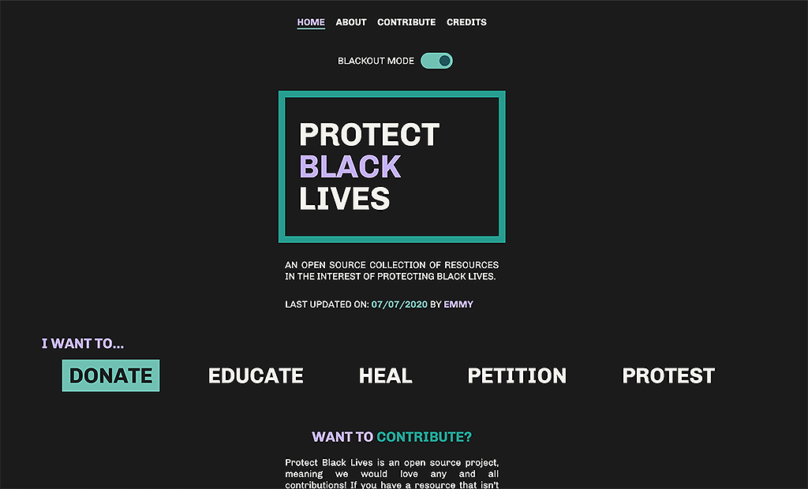

# Protect Black Lives
## An open source collection of resources in the interest of protecting all Black lives.

**Protect Black Lives** was created in the interest of protecting all Black lives, in direct response to the world's
protesting of George Floyd's tragic murder. This project has no affiliation with any existing organizations, and was created by an [individual](https://github.com/emmy-html) hoping to spread awareness and education on the effects of systemic racism and how we can enact change.

## Contributions

Please review our [guidelines](https://protectblacklives.github.io/go/contribute/#submission) before contributing your resource.

**Don't know how to code?** 

Don’t know how to code, but still want to help? No problem! You can contribute your resource or suggestion by submitting it via this [form](https://forms.gle/sMTRUnXhTj4hdm127).

## Want to contribute a resource you've found? Submit a pull request!

Any resource that isn’t already listed or needs to be updated is welcome to be submitted via a pull request. All contributions involving improving the accessibility of this website are also more than welcome!
[GitHub Pull Request Documentation](https://docs.github.com/en/github/collaborating-with-issues-and-pull-requests/creating-a-pull-request)
1. Grab the link to the resource you want to add. Make sure this is a direct link to your content.
2. After you fork the repo, create a new branch for your changes. When naming, use the format **[username-resource]**
3. Go to the directory that matches the **type** of resource you are adding. For example, I'm adding a donation resource, so I will go to **donate/index.html**.
4. CTRL + F to find `p class="filterLink"`
When you get there, you'll see the code you need to add your resource. Add the link, and change the title accordingly.
Make sure you're adding your resource to the **top** of the container, `filter-content-container`.
5. Figure out what category and topic(s) your resource belongs to. Here, we filter things by **two** criteria.
The **type** of resource (Donate, Educate, Heal, Petition, or Protest)
And the **topics** that resource covers. These are the options that you see on the page that allows you to filter through resources.
If you have a resource that has multiple types, feel free to add it to both files.
6. By now, you've probably noticed the `span` element for the filter buttons. These will allow people to find your resource once you've added it. Add the appropriate tags according to the **topics** you identified in step 5.
* If your topic doesn't exist, feel free to create a new one with an appropriate name!
6. Add a comment **above** your resource that says `Submitted by [your name]`
You're done! Submit your pull request and wait for approval.